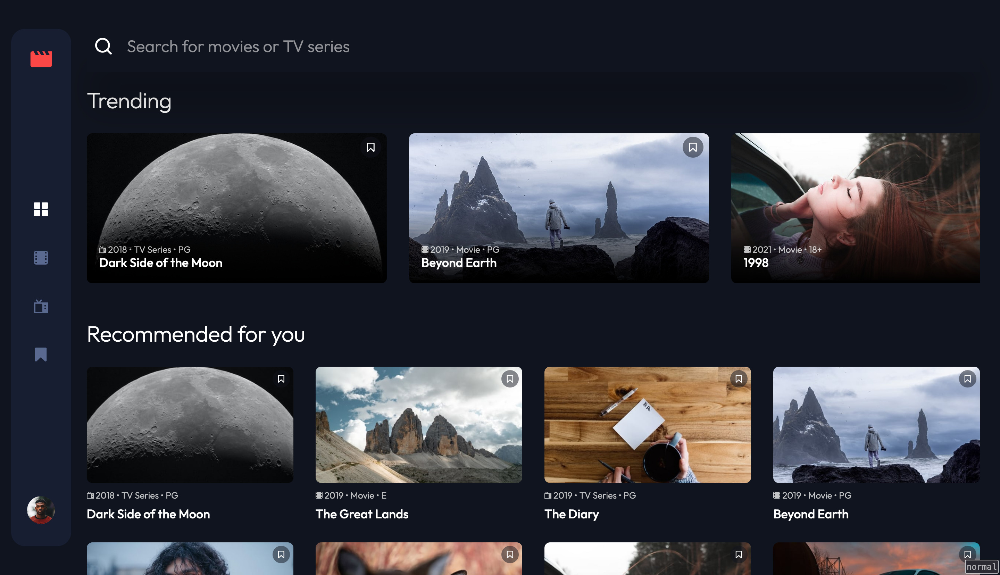

# Frontend Mentor - Entertainment web app solution

This is a solution to the [Entertainment web app challenge on Frontend Mentor](https://www.frontendmentor.io/challenges/entertainment-web-app-J-UhgAW1X). Frontend Mentor challenges help you improve your coding skills by building realistic project.

## Table of contents

- [Overview](#overview)
  - [The challenge](#the-challenge)
  - [Screenshot](#screenshot)
  - [Links](#links)
- [My process](#my-process)
  - [Built with](#built-with)
  - [What I learned](#what-i-learned)
  - [Continued development](#continued-development)
  - [Useful resources](#useful-resources)
- [Author](#author)
- [Acknowledgments](#acknowledgments)

## Overview

### The challenge

Users should be able to:

- View the optimal layout for the app depending on their device's screen size
- See hover states for all interactive elements on the page
- Navigate between Home, Movies, TV Series, and Bookmarked Shows pages
- Add/Remove bookmarks from all movies and TV series
- Search for relevant shows on all pages
- **Bonus**: Build this project as a full-stack application (future implementation)
- **Bonus**: If you're building a full-stack app, we provide authentication screen (sign-up/login) designs if you'd like to create an auth flow (future implementation)

### Screenshot

### Links

- [Solution URL](https://www.frontendmentor.io/solutions/entertainment-streaming-web-app-using-vite-react-typescript-template-T7eJmAeTAt)
- [Live Site URL](https://entertainment-streaming.vercel.app/home)

## My process

Here is a timeline of the process I went through:

- Initialise Vite React + Typescript template, setup linting and formatting configuration.
- No dependencies required to install in the beginning. Initially I wanted to use the css modules approach which comes pre-packaged with the starting template.
- Replicated the "Design System" from figma to create the design tokens required for the project. Put the design tokens in `index.css` for use in every CSS file.
- Looked at the design file to realise all the components required for the challenge. Before setting up the router, I developed all the components of the app first.
- Installed React Router dependencies and created the app routes.
- First I worked on the Search feature and after that on the Bookmarks feature. Used 'zustand' for global state management, and for syncing state across all the routes.
- Implemented persist local storage so that bookmarks are not lost after reloading the page.
- Worked on making CSS responsive across all sizes. I used mobile first approach for initial development process.
- Initially, the components were not accessible at all. So I had to refactor the markup to improve accessibility.
- All the thumbnails were using the CSS `background-image` property. This caused images to load after all the CSS assets have been downloaded. Removed the propery and implemented `<picture>` element instead to improve page load performance.
- Converted all the images to `.webp` format, to improve page page load performance.

### Built with

- Semantic HTML5 markup
- CSS custom properties
- Flexbox
- CSS Grid
- Mobile-first workflow
- [React](https://reactjs.org/) - JS library
- [Zustand](https://zustand-demo.pmnd.rs/)
- [React Router](https://reactrouter.com/en/main)
- [PostCSS](https://postcss.org/)

### What I learned

- This is the first time I used TypeScript on any project.
- Writing accessible Slider and Card components.
- How to improve performance by using modern image formats, and localizing the fonts instead of using Google CDN. And optimizing lighthouse score.
- Responsive typography and fluid CSS design techniques.
- This was my first time using Grid layout in a challenge. Before this I used flexbox most of the time.
- Use of `<picture>` element.
- Using React router and Zustand.

### Continued development

Overall I am not happy how the process turned out. Initially I had planned to use CSS modules using the design tokens I had created. But I realized that using more than one class name using CSS modules seemed counter-intuitive to the module based approach. So I decided to not use CSS modules which I think made the CSS unorganised. There are a lot of changes to be desired for in the CSS I have written initially.

During this project I also realized that I am not using the proper git workflow. I develop all the features one by one on a single branch and create commits and move on to the next feature. From next time I plan to cut a new branch and use conventional commits. Once I am done working on a feature, I will merge it to the main branch.

I didn't account for accessible markup when I first developed the components. This led to changing the markup, and also a lot of CSS class names after I was done working on some features. It created a lot of unnecessary challenges which could've been avoided if I accounted for accessible markup from the get go.

In future challenges I would like to start development by setting up CI/CD pipelines first. Develop feature by feature, write automated tests, and use [conventional commits](https://www.conventionalcommits.org/en/v1.0.0/).

### Useful resources

- [Utopia](https://utopia.fyi/) - Fluid responsive design.
- [Inclusive components](https://inclusive-components.design/) - For developing accessible card and slider components.
- [Website performance metrics](https://web.dev/metrics/)

## Author

- Frontend Mentor - [@mohantee](https://www.frontendmentor.io/profile/mohantee)

## Acknowledgments

From the bottom of my heart, I would like to thank the Front-end mentor community for replying to my queries and doubts instantly. Special shout-out to Grace-Snow and AlexKMarshall. This solution would've left a lot to be desired for, without their continued support. I also don't have to scourge through the internet looking for best practice guides as they are always available to answer every question I have, which saves a lot of time and makes the development process smoother.
